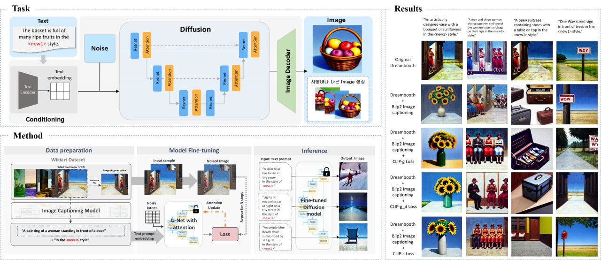
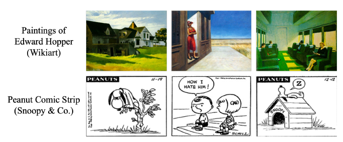
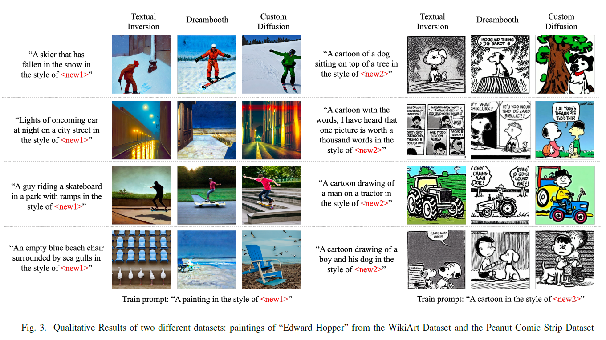
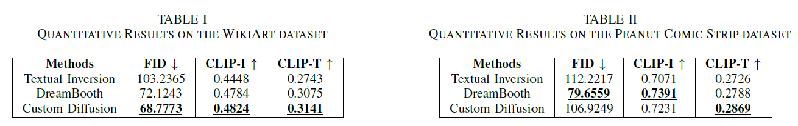

# A Study of Style Transfer using T2I Models

## &#x1F4E2; Project Overview: 2406~2409

### Overview Schema & In-depth Results of Dreambooth (2023 CVPR)



### 주요 기능
- Diffusion Inversion-based (Image-to-Text) 방법 기반 Style Transfer 연구
- 다양한 평가 지표(e.g., FID, CLIP-I, CLIP-T, Gram loss) 활용
- 데이터셋 종류별로 스타일 전이 성능에 차이가 있음을 확인 (-> general 성능의 스타일 전이 모델 필요)

----

### &#x1F31F; Diffusion T2I 모델 리스트
- Textual Inversion
- Derambooth
- Custom Diffusion

### &#x1F4AB; 성능 평가 지표 리스트
- Fréchet Inception Distance (FID): 이미지 간의 유사성
- CLIP Image Similarity Score (CLIP-T): 텍스트와 이미지 간의 의미적 일치도
- CLIP Text Similarity Score (CLIP-T): 텍스트와 이미지 간의 의미적 일치도
- Gram Loss (style loss, VGG19): 레퍼런스 이미지와의 스타일 유사성

### 📝 데이터셋

- Wikiart dataset from [github](https://github.com/cs-chan/ArtGAN/blob/master/WikiArt%20Dataset/README.md) or [kaggle](https://www.kaggle.com/datasets/steubk/wikiart)
- Peanuts (Snoopy & co.) from [hugging face](https://huggingface.co/datasets/afmck/peanuts-opt-6.7b)


----

### 💻 실험 방법
#### 1. 가상 환경 설정

```bash
conda create -n diffusion python=3.9
conda activate diffusion

cd ./A_Study_of_Style_Transfer_using_T2I_Models

pip install -r requirements.txt
```
> **Note**: GPU 사용 가능 환경에서 실행 권장

#### 2. 모델 학습

```bash
python train.py \
    --model "{모델명}" \
    --instance_dir "data/peanuts" \ #'data/wikiart'
    --output_dir "save/model_ckpt"
```
> **모델명**: > textual_inversion, dreambooth, custom_diffusion


#### 3. Stylized Images 생성
```bash
python inference.py \
    --model "{모델명}" \
    --model_dir "save/model_ckpt" \
    --save_dir "save/images" \ 
    --prompt_dir "data/prompts" #prompt_dir
```
> **모델명**: textual_inversion, dreambooth, custom_diffusion

----

### 📄 논문 투고 및 게재 (2025 ICCE)
A Study of Style Transfer based on Text-to-Image Diffusion Models
[[paper]](./A_Study_of_Style_Transfer_based_on_Text-to-Image_Diffusion_Models.pdf) 

(Sojeong Kim, A-Seong Moon, Mingi Kim, Jaesung Lee*)



